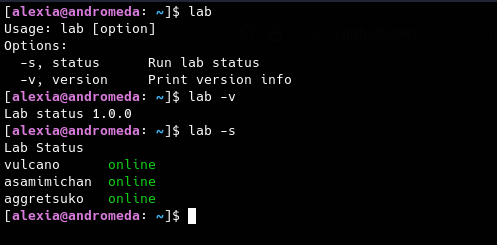

# LAB STATUS

Simple lab status checker. Requires Ansible.

This script will check against the existing inventory and return the status online if the host is reacheable or offline otherwise.

If you want to check against a specific inventory only, change the ansible query all for the specific tag in your ansible hosts file 
```(see /etc/ansible/hosts)```




## Recommended install

give execution permissions and move the 'lab' script to /usr/local/bin

```sudo chmod a+x lab && sudo mv lab /usr/local/bin```

## Usage

lab -s or lab status to check the status
lab -v or lab version to check the current version

This is a work in progress, many more features will be added later, if you would like to improve on this feel free to open an issue with your suggestions,
or fork & send a pull request with your changes.

## Author

Alexia Michelle 


### License

GNU GPL 3.0

### Other notes

Make sure you have ansible installed on the control machine and have a specific user assigned to ansible with unidirectional ssh key exchange against the target hosts
